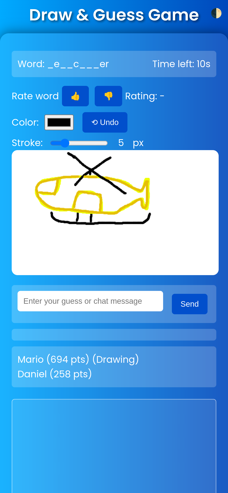

# Daniel Schweiger 👨‍💻

Welcome to my personal website. I am a senior software engineer with over 7 years of experience in developing software solutions for various industries. I am passionate about building robust, scalable, and maintainable software systems that solve real-world problems. 

## Short Summary of Myself 🙇‍♂️
Self aware, open-minded & optimistic individuum taking actions on long term opportunities.

## Projects 🚀

Here are some of the projects that I have worked on:

### Chat Worm - Advanced ChatGPT Client 🐛

I am currently working on a project called [Chat Worm](https://www.chatworm.com), which is a progressive web app alternative to ChatGPT written in Angular. This tool has multiple advantages, including availability even when the original chat platform is down, faster response time, and cost-effectiveness as users only pay per tokens. Additionally, the application is customizable, which lets users change the randomness of AI assistant's responses, and it offers multiple models, including those with no content policy. Along with all these features, [Chat Worm](https://www.chatworm.com) offers many more features that make it a versatile and useful tool for anyone looking for an AI assistant for chatting. The best thing is, Chat Worm is open-source and can be found on [GitHub](https://www.github.com/UnknownEnergy/chatgpt-api).
  
Screenshot:  

### Draw And Guess - Game 🎨🕵️‍♂️

Introducing [Draw And Guess](https://unknownenergy.itch.io/draw-and-guess), a fun and interactive game where creativity meets laughter! In this engaging web app and Android game, players race against the clock to draw quirky prompts while others try to guess what they are sketching. 

Features include:
- Unleash your artistic flair as you tackle wacky drawing challenges.
- Compete with friends in real-time matches, regardless of distance.
- Enjoy the hilarious results of your friends' artistic attempts, whether they're masterpieces or comical disasters.

Whether you're an accomplished artist or just enjoy doodling, Draw And Guess is all about having fun and letting your imagination run wild. Check out the Android app on the [Google Play Store](https://play.google.com/store/apps/details?id=quest.schweiger.drawandguess.twa) for gaming on the go!

Screenshot:  

### Solitaire - Classic Card Game ♠️

Introducing [Solitaire](https://unknownenergy.github.io/solitaire/), a beautifully designed and intuitive implementation of the classic card game. Whether you're a seasoned player or new to the game, Solitaire offers a relaxing and engaging experience. Play it in your browser or download the Android app for gaming on the go! You can find the app on the [Google Play Store](https://play.google.com/store/apps/details?id=io.github.unknownenergy.twa). 

For those interested in the development behind the game, the source code is available on [GitHub](https://github.com/UnknownEnergy/solitaire). Enjoy a timeless classic with modern flair!

Screenshot:  

## Skills 👨‍🔬

Here are some of the skills that I possess:

- AI & Blockchain Technology
- Java, Kotlin, Node.js
- Angular, React, VueJs
- MySQL, PostgreSQL
- Git, JIRA, Confluence
- Linux, Windows
- Agile Methodologies
- Requirements Engineering
- IT Management

## Social Media 🌐

You can find me on the following social media platforms:

- [LinkedIn](https://www.linkedin.com/in/daniel-schweiger/) Business only
- [Twitter](https://twitter.com/MrCryptoDan) Crypto & NFT & AI only
- [GitHub](https://github.com/UnknownEnergy) Sofware Projects only
- [Facebook](https://www.facebook.com/daniel.schweiger.12) Private only
- [Instagram](https://www.instagram.com/crypto.daniel/) Private only
- [Reddit](https://www.reddit.com/user/Unknown_Energy) Random
- [YouTube](https://www.youtube.com/@danielschweiger) Crypto & NFT only

## Secret Book Recommendations 📖

Here are some of my favorite books I would also recommend reading:

- Emotional Intelligence - Book about the connection between our brain and emotions and how to better deal with them [Link](https://www.amazon.com/Emotional-Intelligence-Matter-More-Than/dp/055338371X)
- Hope and Help for Your Nerves - Do you have any kind of nervous system issue, anxiety, headaches, sleeplessness etc. read this book [Link](https://www.amazon.com/Hope-Help-Your-Nerves-Anxiety-ebook/dp/B009PFN4IQ)
- The Diet Compass - Book about diet and health underlined with related studies for a healtier body and mind [Link](https://www.amazon.com/Diet-Compass-Science-Based-Nutrition-Healthier/dp/1950354296)
- The Red Queen - Book about evolution, history and an endless fight between sex and mutating predators [Link](https://www.amazon.com/Matt-Ridley/dp/0060556579)
- Extreme Ownership - Book about good and bad leadership. Should be read by your boss and you ;) [Link](https://www.amazon.com/Extreme-Ownership-U-S-Navy-SEALs/dp/1250067057)
- The Plant Paradox: The Hidden Dangers in "Healthy" Foods - Do you think you eat healty and never heard about lectin? This book might be for you [Link](https://www.amazon.com/Plant-Paradox-Dangers-Healthy-Disease/dp/006242713X)
- The Bitcoin Standard - Book about Bitcoin, history of money and how money works [Link](https://www.amazon.com/Saifedean-Ammous/dp/1119473861)
- Souverän investieren mit Indexfonds und ETFs - Book for long-term investing (German) [Link](https://www.amazon.com/Souver%C3%A4n-investieren-Indexfonds-ETFs-Book/dp/3593508524)
- Asthma einfach wegatmen - Book if you have any kind of lung & nose issue like asthma, snoring etc. (German) [Link](https://www.amazon.de/Asthma-einfach-wegatmen-wissenschaftlich-Heuschnupfen/dp/3742310992)

## Others & Affiliates 🤝
- [Countries I visited](https://visitedplaces.com/world/?map=world&projection=geoOrthographic&theme=dark-green&water=1&graticule=0&names=1&duration=2000&placeduration=100&slider=0&autoplay=1&autozoom=none&autostep=1&home=AT&places=My%20Home~AT~1_0_0_-14.1_-47.6*Europe~FR_BE_BA_BG_HR_CZ_DE_GR_HU_IT_LV_LT_MC_NL_NO_PL_RO_SK_SI_ES_CH_TR_UA_GB_SE_DK_AL_ME_FI_EE_MK_RS~2.4_12.1_53.3_-12.1_-53.3)
- [Spotify](https://open.spotify.com/user/unknown_energy?si=4esOIVhKSpaYN260XJCjrQ) Music I listen to
- [Binance](https://www.binance.com/?ref=21762885) Crypto exchange - cheap & discount
- [Blockpit](https://blockpit.cello.so/QLfnWWB7LMZ) Crypto tax report - quick & discount
- [Uber](https://www.uber.com/invite/ys0k3d) Uber 5$ off your first ride

## Tips 💰💸

If you found my work helpful and would like to support me, you can use any of the following links to donate:
 
- [PayPal](https://paypal.me/danschweiger)
- [Ko-fi](https://ko-fi.com/schweiger)
- Bitcoin Address: 1Beer4MeHd1ybUeWWKxA6ieYV7xiufQxUE

Overall, my goal is to create innovative and efficient solutions to solve challenging problems in the software development industry. Feel free to connect with me on social media or email for any project ideas or collaborations.
